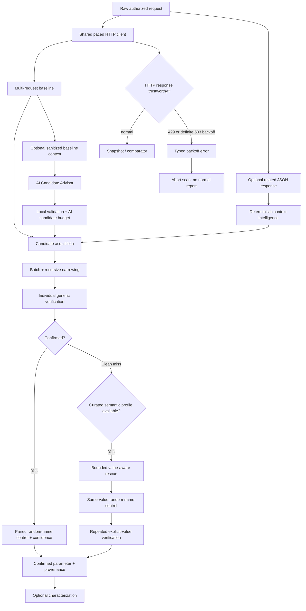

# ParamIntel v0.6.0

ParamIntel is an evidence-oriented HTTP parameter discovery and behavioral-analysis tool for authorized web security testing and bug bounty research.

Instead of treating any response difference as a valid parameter, ParamIntel asks two questions:

> **Does this specific parameter produce reproducible application behavior that a random unknown parameter does not?**
>
> **Are the responses used to make that decision trustworthy application observations rather than known rate-limit/backoff responses?**

A reported parameter remains a **research lead**, not proof of a vulnerability. Authorization, business-logic impact, exploitability, and program rules still require manual validation.

## Version progression

ParamIntel has evolved in four deliberate layers:

- **v0.3 — better candidate names:** derive high-signal JSON candidates from a related response;
- **v0.4 — better candidate values:** rescue clean generic misses with a small curated semantic value profile;
- **v0.5 — better evidence integrity:** prevent definite rate-limit/backoff responses from entering the comparator and optionally pace all requests with one global policy;
- **v0.6 — better candidate hypotheses:** optionally use an AI Candidate Advisor to propose high-signal names and placements from sanitized application structure while keeping verification deterministic.

The v0.6 rule is simple:

> **AI may decide what is worth testing. Only ParamIntel's deterministic verifier may decide what behaved differently.**

## What v0.6 adds

- optional `-ai-advisor` candidate-hypothesis generation, disabled by default;
- a provider-neutral internal adapter boundary, with Gemini as the first provider;
- `gemini-3.5-flash-lite` as the default Gemini model, with `-ai-model` override support;
- automatic reuse of one already-collected baseline response as AI context, avoiding an extra target request;
- local sanitization before provider calls: structure is shared, raw captured traffic is not;
- omission of hostnames, Authorization/Cookie data, query/form values, JSON primitive values, raw response text, and user wordlist names from provider input;
- a deterministic local admission gate for malformed, duplicate, already-present, impossible, or already-covered suggestions;
- `-ai-candidate-budget` to bound admitted AI hypotheses;
- explicit AI provenance and audit data without allowing AI priority/reason to influence confidence;
- a two-minute default provider timeout with no automatic retry or silent background/stored execution;
- continued use of ParamIntel's existing negative controls, repeated verification, confidence model, pacing, and rate-limit evidence-integrity rules for every AI-suggested candidate.

The final localhost acceptance for v0.6 used a parameter named `include_archived` that normal built-in candidate acquisition did not cover. Gemini proposed it, and ParamIntel independently verified **3/3 candidate changes vs. 0/3 paired random-name control changes**, producing **1.00 HIGH** confidence and zero false findings in that acceptance run.

## Discovery and evidence model



Important invariants:

> **A known rate-limit/backoff response must never influence ParamIntel confidence or behavioral evidence.**

> **An AI suggestion is only a hypothesis until deterministic probing and controls verify candidate-specific behavior.**

## AI Candidate Advisor

The advisor is opt-in. For Gemini, set the API key in the environment rather than placing it on the command line.

PowerShell 7:

```powershell
$env:GEMINI_API_KEY = Read-Host "Gemini API key" -MaskInput
```

Then run:

```powershell
.\paramintel.exe `
  -request .\burprequests\request.txt `
  -ai-advisor `
  -ai-provider gemini `
  -ai-candidate-budget 12 `
  -baseline 3 `
  -trials 3 `
  -verbose `
  -output .\findings.json
```

By default, ParamIntel:

1. validates the provider configuration and key locally;
2. collects its normal baseline;
3. reuses one already-collected baseline response;
4. sanitizes that response and request structure locally;
5. asks the advisor for candidate names/placements;
6. applies the local admission gate and budget;
7. passes accepted hypotheses into the existing deterministic verifier.

Use a different related response only when you intentionally want different AI context:

```text
-ai-context-response response.txt
```

The report records either:

```json
"context_source": "baseline_response"
```

or:

```json
"context_source": "ai_context_response"
```

### AI privacy boundary

The provider can receive bounded structural metadata such as:

- HTTP method;
- sanitized URL path;
- query/form parameter names, never their values;
- request/response JSON property names and primitive types, never primitive values;
- valid JSON insertion parents;
- active discovery locations;
- built-in candidate names used as exclusions.

It intentionally does not receive:

- hostname;
- Authorization headers;
- Cookie or Set-Cookie values;
- API keys or bearer tokens;
- query/form values;
- JSON primitive values;
- raw response text;
- arbitrary headers;
- user-supplied wordlist names.

See `docs/v0.6-ai-candidate-advisor.md` and `docs/v0.6-ai-advisor-observability.md` for the design and audit details.

## Rate-limit and backoff behavior

ParamIntel rejects known limiter responses before they can become evidence.

### HTTP 429

Every HTTP `429 Too Many Requests` is treated as rate limiting and rejected from behavioral comparison.

Example diagnostic:

```text
error: rate limit detected: HTTP 429 (Retry-After: 2); response was not used as discovery evidence
```

### HTTP 503

A `503 Service Unavailable` is treated as explicit server backoff only when accompanied by a valid `Retry-After` value.

```text
503 + valid Retry-After
→ server backoff
→ response rejected from evidence

503 without Retry-After
→ ordinary application response

503 + malformed Retry-After
→ ordinary application response
```

An ordinary `403` is not automatically classified as rate limiting because it may represent authorization, WAF, anti-bot, or application behavior relevant to the experiment.

## Global request pacing

Use:

```text
-delay 250ms
```

The value is a minimum interval between request starts, not an unconditional sleep after every response. The same pacing policy applies globally to baseline sampling, candidate probing, controls, value-aware rescue, and characterization.

Default:

```text
-delay 0
```

ParamIntel does not automatically replay requests after a known 429/503-backoff response.

## Value-aware discovery

Some parameters ignore arbitrary values:

```text
/api/users
→ baseline

/api/users?debug=whatever
→ baseline

/api/users?debug=true
→ debug data added

/api/users?random_name=true
→ baseline
```

After a **clean generic miss**, ParamIntel can use a small curated semantic profile and compare the candidate against a same-value random-name control:

```text
debug=true
vs
zz_pi_<random>=true
```

Controls:

```text
-value-aware=true
-value-aware-budget 64
```

The semantic budget is a hard request cap. `-characterize=false` does not disable value-aware discovery.

## Deterministic context intelligence

A related JSON response can contribute application-specific candidate names without contributing attack values.

Suppose the request contains:

```json
{
  "options": {
    "page_size": 10
  }
}
```

and a related response contains:

```json
{
  "options": {
    "page_size": 10,
    "include_deleted": false
  }
}
```

ParamIntel can derive:

```text
$.options.include_deleted
source: context_response_only_json_property
observed type: boolean
```

Context harvesting remains deliberately narrow: only JSON property keys become candidates, values are never tokenized into names, missing parent objects are not synthesized, and arrays are not traversed as insertion targets.

## Build

Requires Go 1.23+.

Linux/macOS:

```bash
go build -trimpath -o paramintel ./cmd/paramintel
```

Windows PowerShell:

```powershell
go build -trimpath -o paramintel.exe .\cmd\paramintel
```

Confirm version:

```powershell
.\paramintel.exe -version
```

Expected:

```text
ParamIntel v0.6.0
```

## Basic query discovery

Save an authorized request:

```http
GET /api/users HTTP/1.1
Host: target.example
Authorization: Bearer REDACTED
Cookie: session=REDACTED

```

Run:

```powershell
.\paramintel.exe `
  -request .\burprequests\users.txt `
  -locations query `
  -baseline 5 `
  -trials 3 `
  -chunk 32 `
  -delay 200ms `
  -verbose `
  -output .\findings.json
```

Use pacing only when it fits the authorized target/program rules.

## Context-response workflow

```powershell
.\paramintel.exe `
  -request .\burprequests\request.txt `
  -context-response .\burpresponses\response.txt `
  -locations json `
  -baseline 5 `
  -trials 3 `
  -chunk 4 `
  -value-aware=true `
  -value-aware-budget 64 `
  -delay 200ms `
  -allow-state-changing `
  -verbose `
  -output .\findings.json
```

## Discovery locations

```text
-locations auto
-locations query
-locations form
-locations json
-locations query,json
```

`auto` always includes query discovery, adds form discovery for `application/x-www-form-urlencoded`, and adds JSON discovery whenever the body parses as a JSON object.

Nested JSON object insertion is controlled with:

```text
-json-depth 3
```

Arrays remain intentionally outside the insertion model.

## Characterization

After a parameter is confirmed, ParamIntel can optionally profile likely values and infer type hints.

Examples include:

- boolean-like: `true`, `false`, `1`, `0`;
- integer-like: `0`, `1`, `10`, `-1`;
- `format`: `json`, `xml`, `html`;
- `sort` / `order`: `asc`, `desc`.

For JSON parameters, boolean and integer values are sent as actual JSON types.

Disable characterization:

```text
-characterize=false
```

## Safety guard for state-changing methods

GET, HEAD, and OPTIONS can run normally.

POST, PUT, PATCH, DELETE, and other methods require explicit acknowledgement because ParamIntel replays the supplied request many times:

```text
-allow-state-changing
```

Use this only after confirming authorization and side-effect risk.

## Verification

Automated release gates:

```bash
go test ./...
go vet ./...
go test -race ./...
```

v0.6 adds a reproducible localhost AI acceptance lab that compares a control run against an AI-enabled run and requires deterministic verification of `include_archived`.

See:

```text
docs/v0.6-ai-candidate-advisor.md
docs/v0.6-ai-advisor-observability.md
labs/v0.6-ai-advisor/README.md
```

The v0.5 evidence-integrity acceptance material remains available in:

```text
VERIFICATION.txt
docs/v0.5-rate-limit-evidence-integrity.md
labs/v0.5-rate-limit/README.md
```

## Known boundaries

v0.6 deliberately does **not** add:

- AI-generated semantic values;
- automatic retry or automatic sleeping after `Retry-After`;
- adaptive concurrency;
- WAF/rate-limit inference from arbitrary 403 pages or response text;
- cache-aware probe correlation;
- server-side parameter-pollution mutation inside another parameter value;
- missing-parent JSON object synthesis;
- array insertion;
- Burp/MCP integration;
- broad business-state enum spraying.

Gemini is the first implemented AI provider adapter. The provider boundary is intentionally isolated so future adapters can be added without changing discovery or confidence logic.

## Project layout

```text
cmd/paramintel/        CLI and safety boundary
internal/aiadvisor/    sanitized AI candidate acquisition and provider adapters
internal/baseline/     baseline collection, send boundary, backoff classification
internal/candidates/   generic candidate wordlists
internal/compare/      semantic response comparison
internal/confidence/   confidence scoring
internal/contextintel/ structured request/response candidate intelligence
internal/discovery/    placement, narrowing, verification, controls, semantic rescue
internal/httppolicy/   shared request-start pacing policy
internal/httpraw/      raw HTTP request parser
internal/model/        shared evidence/result types
internal/mutate/       query/form/JSON mutation engine
internal/semantics/    type inference and curated semantic value profiles
labs/                  reproducible local acceptance labs
```

## Scope and responsible use

Use ParamIntel only on systems you own or are explicitly authorized to test. Respect bug bounty scope, published rate limits, forbidden actions, and data-handling rules. ParamIntel discovers and characterizes inputs; it does not automatically claim that a discovered parameter is vulnerable.

Raw Burp requests and responses can contain session cookies, authorization headers, identifiers, and target data. Keep local research artifacts out of source control. The default `.gitignore` excludes `burprequests/`, `burpresponses/`, and `wordlists/` for this reason.
