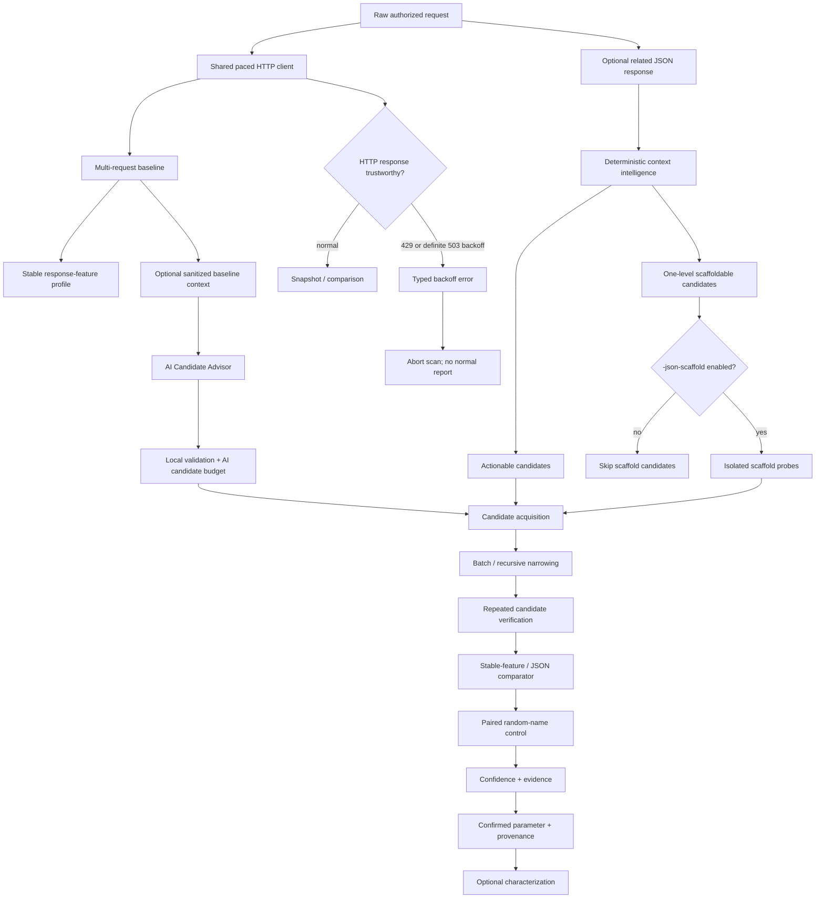

# ParamIntel v0.8.0

ParamIntel is an evidence-oriented HTTP parameter discovery and behavioral-analysis tool for authorized web security testing and bug bounty research.

Instead of treating any response difference as a valid parameter, ParamIntel asks:

> **Does this specific parameter produce reproducible application behavior that a random unknown parameter does not?**
>
> **Are the responses and response features used to make that decision stable enough to trust?**

A reported parameter is a **research lead**, not proof of a vulnerability. Authorization, exploitability, business impact, and program rules still require manual validation.

## Version progression

ParamIntel has evolved in deliberate layers:

- **v0.3 — better candidate names:** derive high-signal JSON candidates from a related response;
- **v0.4 — better candidate values:** rescue clean generic misses with bounded semantic values and same-value random-name controls;
- **v0.5 — better evidence integrity:** keep known rate-limit/backoff responses out of evidence and optionally pace all requests;
- **v0.6 — better candidate hypotheses:** optionally use an AI Candidate Advisor while keeping deterministic verification authoritative;
- **v0.7 — better evidence fidelity:** learn stable response features and detect subtle non-JSON behavior without abandoning negative controls;
- **v0.8 — deeper structured JSON discovery:** optionally test narrowly response-derived nested fields behind exactly one missing object parent.

The v0.8 rule is:

> **ParamIntel may create exactly one missing JSON object level only for a deterministic response-derived candidate, only when its direct ancestor already exists as a request object, and only when the user explicitly enables `-json-scaffold` together with `-context-response`.**

Scaffolding changes where a candidate can be placed. It does not create evidence, increase confidence, or bypass the normal verifier.

## What v0.8 adds

Before v0.8, context intelligence could see a nested response-only field such as:

```json
{
  "profile": {
    "name": "tobias",
    "settings": {
      "beta_access": false
    }
  }
}
```

but if the captured request was only:

```json
{
  "profile": {
    "name": "tobias"
  }
}
```

ParamIntel could not test:

```text
$.profile.settings.beta_access
```

because `$.profile.settings` did not exist in the request.

v0.8 can classify that leaf as **scaffoldable** and, with explicit opt-in, temporarily create exactly the missing `settings` object for verification.

Candidate:

```json
{
  "profile": {
    "name": "tobias",
    "settings": {
      "beta_access": "probe"
    }
  }
}
```

Paired random-name control:

```json
{
  "profile": {
    "name": "tobias",
    "settings": {
      "zz_pi_random": "probe"
    }
  }
}
```

The object structure and value are identical. Only the leaf name changes.

If simply creating `settings` or putting any child inside it changes behavior, the control reproduces the signal and ParamIntel rejects the candidate.

## Controlled JSON scaffolding

Scaffolding is disabled by default.

Enable it only with deterministic response context:

```powershell
.\paramintel.exe `
  -request .\burprequests\request.txt `
  -context-response .\burpresponses\response.json `
  -locations json `
  -json-scaffold `
  -allow-state-changing `
  -baseline 5 `
  -trials 3 `
  -verbose `
  -output .\findings.json
```

`-json-scaffold` without `-context-response` fails locally before target probing.

### What may be scaffolded

A response-derived candidate is eligible only when:

- its immediate JSON parent is absent from the request;
- the missing parent's direct ancestor already exists as an object;
- exactly one object level is missing;
- the missing parent path came from deterministic context-response structure;
- the user enabled `-json-scaffold`.

### What may not be scaffolded

v0.8 will not:

- create two or more missing object levels;
- replace an existing object;
- replace `null`;
- replace a scalar;
- replace an array;
- use an array as a scaffold insertion target;
- invent missing parent names from the generic wordlist;
- let the AI Candidate Advisor invent missing parent paths;
- copy response primitive values into probe values.

Scaffold candidates are isolated into one-candidate initial groups rather than being bulk-batched with generic discovery.

See:

```text
docs/v0.8-controlled-json-scaffolding.md
labs/v0.8-json-scaffolding/README.md
```

## v0.8 acceptance

The localhost and automated CLI acceptance suites prove:

1. a response-derived nested field behind one missing parent can be confirmed;
2. the real candidate can change 3/3 trials while the paired random-name control changes 0/3;
3. generic behavior caused by any child under the synthesized parent is rejected when the control reproduces it;
4. disabling scaffolding prevents scaffold candidates from being sent;
5. existing object, `null`, scalar, and array parents are not replaced through the scaffold path;
6. paths requiring two missing object levels are rejected;
7. scaffold candidates remain isolated from bulk first-pass groups;
8. the real CLI path composes with `-context-response` and the state-changing-method safety gate.

## Discovery and evidence model



Important invariants:

> **A known rate-limit/backoff response must never influence ParamIntel confidence or behavioral evidence.**

> **An AI suggestion is only a hypothesis until deterministic probing and controls verify candidate-specific behavior.**

> **A new response feature is not evidence unless baseline sampling establishes the required stability.**

> **A scaffold is placement metadata, not evidence. The paired random-name control receives the same scaffold.**

## v0.7 evidence fidelity remains active

v0.7 added stable response-feature evidence for dynamic non-JSON responses.

Depending on baseline stability and response type, evidence can include:

```text
status
content_type
header_added
header_removed
header_value_changed
html_structure_changed
line_count
word_count
json_path_added
json_path_removed
json_value_changed
body_changed
body_length
```

For JSON responses, stable JSON path semantics remain authoritative. Header evidence records eligible header names rather than raw custom-header values.

See:

```text
docs/v0.7-evidence-fidelity.md
labs/v0.7-evidence-fidelity/README.md
```

## Deterministic context intelligence

A related JSON response can contribute application-specific candidate names without contributing attack values.

If the response contains a property absent from the request:

- parent already exists in the request → **actionable** candidate;
- exactly one parent object is missing and its ancestor exists → **scaffoldable** candidate;
- deeper/mismatched structure → skipped.

Response text values are never tokenized into candidate names.

Without `-json-scaffold`, the v0.3 behavior remains: only candidates whose parent already exists are active.

## AI Candidate Advisor

The v0.6 AI Candidate Advisor remains optional and disabled by default. AI may propose candidate names and valid placements, but it cannot create findings or raise evidence confidence by itself.

AI candidates do **not** receive v0.8 scaffold authority. Missing-parent scaffolding is reserved for deterministic `-context-response` classification.

For Gemini:

```powershell
$env:GEMINI_API_KEY = Read-Host "Gemini API key" -MaskInput
```

Then:

```powershell
.\paramintel.exe `
  -request .\burprequests\request.txt `
  -ai-advisor `
  -ai-provider gemini `
  -ai-candidate-budget 12 `
  -baseline 3 `
  -trials 3 `
  -verbose `
  -output .\findings.json
```

The provider receives bounded structural metadata rather than raw captured traffic. Hostnames, Authorization/Cookie data, query/form values, JSON primitive values, raw response text, arbitrary headers, and user wordlist names are intentionally excluded.

See:

```text
docs/v0.6-ai-candidate-advisor.md
docs/v0.6-ai-advisor-observability.md
```

## Rate-limit and backoff integrity

Known limiter/backoff responses are rejected before they can become behavioral evidence.

- every HTTP `429 Too Many Requests` is treated as rate limiting;
- HTTP `503 Service Unavailable` is treated as explicit backoff only when accompanied by a valid `Retry-After` value;
- ordinary 503 responses without a valid `Retry-After` remain available to normal comparison;
- ordinary 403 responses are not automatically classified as rate limiting.

ParamIntel does not automatically retry after known backoff responses.

## Global request pacing

Use:

```text
-delay 250ms
```

The same transport-level request-start pacing policy applies to baseline collection, candidate probes, controls, scaffold probes, value-aware rescue, and characterization.

Default:

```text
-delay 0
```

## Value-aware discovery

Some parameters only react to specific values:

```text
?debug=whatever    -> baseline behavior
?debug=true        -> changed behavior
?zz_pi_random=true -> baseline behavior
```

After a clean generic miss, ParamIntel can try a small curated semantic profile while preserving same-value random-name controls.

Controls:

```text
-value-aware=true
-value-aware-budget 64
```

Scaffold candidates that reach value-aware discovery use the same scaffold authorization and random-control symmetry as generic verification.

## Build

Requires Go 1.23+.

Linux/macOS:

```bash
go build -trimpath -o paramintel ./cmd/paramintel
```

Windows PowerShell:

```powershell
go build -trimpath -o paramintel.exe .\cmd\paramintel
```

Confirm version:

```powershell
.\paramintel.exe -version
```

Expected:

```text
ParamIntel v0.8.0
```

## Basic query discovery

```powershell
.\paramintel.exe `
  -request .\burprequests\users.txt `
  -locations query `
  -baseline 5 `
  -trials 3 `
  -chunk 32 `
  -delay 200ms `
  -verbose `
  -output .\findings.json
```

## Standard context-response workflow

Without scaffolding:

```powershell
.\paramintel.exe `
  -request .\burprequests\request.txt `
  -context-response .\burpresponses\response.txt `
  -locations json `
  -baseline 5 `
  -trials 3 `
  -allow-state-changing `
  -verbose `
  -output .\findings.json
```

This keeps the original rule: contextual nested candidates are active only when their parent object already exists in the request.

## Deeper JSON context workflow

With controlled one-level scaffolding:

```powershell
.\paramintel.exe `
  -request .\burprequests\request.txt `
  -context-response .\burpresponses\response.txt `
  -locations json `
  -json-scaffold `
  -baseline 5 `
  -trials 3 `
  -chunk 4 `
  -value-aware=true `
  -value-aware-budget 64 `
  -delay 200ms `
  -allow-state-changing `
  -verbose `
  -output .\findings.json
```

## Discovery locations

```text
-locations auto
-locations query
-locations form
-locations json
-locations query,json
```

`auto` always includes query discovery, adds form discovery for `application/x-www-form-urlencoded`, and adds JSON discovery when the request body parses as a JSON object.

Existing nested JSON object insertion is bounded with:

```text
-json-depth 3
```

Arrays remain outside the insertion/scaffolding model.

## Characterization

After a parameter is confirmed, ParamIntel can optionally profile likely values and infer type hints.

Disable characterization with:

```text
-characterize=false
```

For JSON parameters, boolean and integer probes are sent as actual JSON types.

## Safety guard for state-changing methods

GET, HEAD, and OPTIONS can run normally.

POST, PUT, PATCH, DELETE, and other methods require explicit acknowledgement because ParamIntel can replay the supplied request many times:

```text
-allow-state-changing
```

`-json-scaffold` does not bypass this requirement.

Use ParamIntel only after confirming authorization and side-effect risk.

## Verification

Automated release gates:

```bash
go test ./...
go vet ./...
go test -race ./...
go build ./cmd/paramintel
```

CI also performs a Windows amd64 cross-build.

Reproducible acceptance material:

```text
labs/v0.8-json-scaffolding/README.md
labs/v0.7-evidence-fidelity/README.md
labs/v0.6-ai-advisor/README.md
labs/v0.5-rate-limit/README.md
```

## Known boundaries

v0.8 deliberately does **not** add:

- multi-level missing-parent JSON synthesis;
- array insertion or array scaffolding;
- replacement of existing `null`, scalar, object, or array parents through scaffolding;
- generic-wordlist missing-parent invention;
- AI-generated missing-parent scaffolds;
- candidate-vs-control evidence-signature attribution when both sides change;
- cache-aware probe correlation or automatic cache-buster orchestration;
- header or cookie discovery locations;
- AI-generated semantic values;
- automatic retry or sleeping after `Retry-After`;
- adaptive concurrency;
- broad WAF/rate-limit inference;
- Burp/MCP integration;
- broad business-state enum spraying;
- automatic exploitation.

Gemini remains the first AI provider adapter. The provider boundary is isolated so future adapters can be added without changing discovery or confidence logic.

## Project layout

```text
cmd/paramintel/            CLI, acceptance tests, and safety boundary
internal/aiadvisor/        sanitized AI candidate acquisition and provider adapters
internal/baseline/         baseline collection, send boundary, backoff classification
internal/candidates/       generic candidate wordlists
internal/compare/          baseline construction and semantic response comparison
internal/confidence/       confidence scoring
internal/contextintel/     structured request/response candidate + scaffold classification
internal/discovery/        placement, narrowing, verification, controls, scaffold gating
internal/httppolicy/       shared request-start pacing policy
internal/httpraw/          raw HTTP request parser
internal/model/            shared evidence/result/candidate types
internal/mutate/           query/form/JSON mutation and controlled scaffold primitive
internal/responsefeatures/ stable response-feature extraction and header fingerprinting
internal/semantics/        type inference and curated semantic value profiles
labs/                      reproducible local acceptance labs
```

## Scope and responsible use

Use ParamIntel only on systems you own or are explicitly authorized to test. Respect bug bounty scope, published rate limits, forbidden actions, and data-handling rules.

Raw Burp requests and responses can contain session cookies, authorization headers, identifiers, and target data. Keep local research artifacts out of source control. The default `.gitignore` excludes `burprequests/`, `burpresponses/`, and `wordlists/`.
