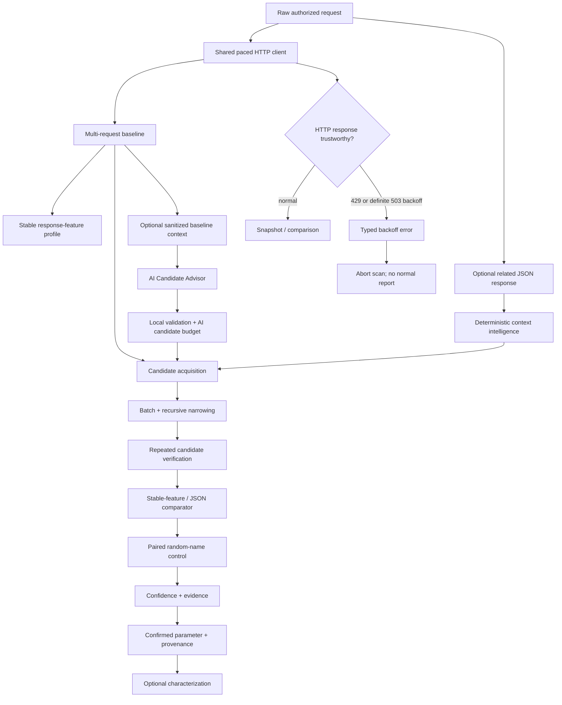

# ParamIntel v0.7.0

ParamIntel is an evidence-oriented HTTP parameter discovery and behavioral-analysis tool for authorized web security testing and bug bounty research.

Instead of treating any response difference as a valid parameter, ParamIntel asks:

> **Does this specific parameter produce reproducible application behavior that a random unknown parameter does not?**
>
> **Are the responses and response features used to make that decision stable enough to trust?**

A reported parameter is a **research lead**, not proof of a vulnerability. Authorization, exploitability, business impact, and program rules still require manual validation.

## Version progression

ParamIntel has evolved in deliberate layers:

- **v0.3 — better candidate names:** derive high-signal JSON candidates from a related response;
- **v0.4 — better candidate values:** rescue clean generic misses with bounded semantic values and same-value random-name controls;
- **v0.5 — better evidence integrity:** keep known rate-limit/backoff responses out of evidence and optionally pace all requests;
- **v0.6 — better candidate hypotheses:** optionally use an AI Candidate Advisor while keeping deterministic verification authoritative;
- **v0.7 — better evidence fidelity:** learn stable response features and detect subtle non-JSON behavior without abandoning negative controls.

The v0.7 rule is:

> **Only response features that prove stable during baseline collection may become new evidence. Candidate-specific behavior must still survive ParamIntel's paired random-name negative control.**

## What v0.7 adds

v0.7 improves observation quality rather than expanding scanner scope.

New deterministic evidence can include:

- normalized `Content-Type` changes;
- eligible response headers being added, removed, or changing value;
- stable HTML structure changes;
- conservative line-count changes;
- conservative word-count changes.

The existing evidence model remains intact:

- HTTP status changes;
- stable JSON path additions/removals/value changes;
- stable-body changes;
- significant body-length changes.

For JSON responses, path-level semantic comparison remains authoritative. The new HTML/text metrics are focused on non-JSON responses where raw-body comparison is more easily obscured by dynamic content.

### Why this matters

A dynamic page may rotate request IDs or timestamps while keeping its real application structure stable. Before v0.7, a hidden parameter that changed only HTML structure or an application-specific response header could be harder to distinguish when body bytes were already dynamic.

v0.7 first learns which response features are stable across the baseline, then permits only those stable observations to become new evidence.

## Evidence-fidelity acceptance

The v0.7 localhost acceptance suite proves these end-to-end cases:

1. **same-size HTML structural behavior** — `preview` changes HTML structure while response size, line count, and word count remain effectively unchanged;
2. **header-only behavior** — `verbose` adds `X-Debug-Mode` while leaving the body unchanged;
3. **rotating response noise** — request IDs change on every response without becoming evidence;
4. **generic unknown-parameter noise** — an endpoint reacts to every unknown parameter, and ParamIntel reports zero findings because the paired random-name control reproduces the behavior;
5. **JSON regression protection** — stable JSON path semantics still identify a real candidate while a rotating response field remains ignored.

Raw custom response-header values are not copied into findings evidence. Header comparison uses local deterministic fingerprints and reports eligible header names only.

See:

```text
docs/v0.7-evidence-fidelity.md
labs/v0.7-evidence-fidelity/README.md
```

## Discovery and evidence model



Important invariants:

> **A known rate-limit/backoff response must never influence ParamIntel confidence or behavioral evidence.**

> **An AI suggestion is only a hypothesis until deterministic probing and controls verify candidate-specific behavior.**

> **A new response feature is not evidence unless baseline sampling establishes the required stability.**

## Evidence kinds

Depending on response type and baseline stability, findings can contain evidence such as:

```text
status
content_type
header_added
header_removed
header_value_changed
html_structure_changed
line_count
word_count
json_path_added
json_path_removed
json_value_changed
body_changed
body_length
```

Header evidence records the header name, not the raw custom-header value. Sensitive/noisy transport and tracing headers are excluded before header evidence comparison.

## AI Candidate Advisor

The v0.6 AI Candidate Advisor remains optional and disabled by default. AI may propose candidate names and placements, but it cannot create findings or raise evidence confidence by itself.

For Gemini, set the API key through the environment:

```powershell
$env:GEMINI_API_KEY = Read-Host "Gemini API key" -MaskInput
```

Then run:

```powershell
.\paramintel.exe `
  -request .\burprequests\request.txt `
  -ai-advisor `
  -ai-provider gemini `
  -ai-candidate-budget 12 `
  -baseline 3 `
  -trials 3 `
  -verbose `
  -output .\findings.json
```

The normal AI path:

1. validates provider configuration locally;
2. collects the normal baseline;
3. reuses one already-collected baseline response;
4. sanitizes request/response structure locally;
5. asks the advisor for candidate names/placements;
6. applies the local admission gate and budget;
7. sends admitted hypotheses through the same deterministic verifier and negative controls as every other candidate.

The provider receives bounded structural metadata rather than raw captured traffic. Hostnames, Authorization/Cookie data, query/form values, JSON primitive values, raw response text, arbitrary headers, and user wordlist names are intentionally excluded.

See:

```text
docs/v0.6-ai-candidate-advisor.md
docs/v0.6-ai-advisor-observability.md
```

## Rate-limit and backoff integrity

Known limiter/backoff responses are rejected before they can become behavioral evidence.

- every HTTP `429 Too Many Requests` is treated as rate limiting;
- HTTP `503 Service Unavailable` is treated as explicit backoff only when accompanied by a valid `Retry-After` value;
- ordinary 503 responses without a valid `Retry-After` remain available to normal comparison;
- ordinary 403 responses are not automatically classified as rate limiting.

ParamIntel does not automatically retry after known backoff responses.

## Global request pacing

Use:

```text
-delay 250ms
```

The value is a minimum interval between request starts. The same transport-level pacing policy applies to baseline collection, candidate probes, controls, value-aware rescue, and characterization.

Default:

```text
-delay 0
```

## Value-aware discovery

Some parameters only react to specific values:

```text
?debug=whatever   -> baseline behavior
?debug=true       -> changed behavior
?zz_pi_random=true -> baseline behavior
```

After a clean generic miss, ParamIntel can try a small curated semantic profile while preserving same-value random-name controls.

Controls:

```text
-value-aware=true
-value-aware-budget 64
```

The request budget is hard-bounded. `-characterize=false` does not disable value-aware discovery.

## Deterministic context intelligence

A related JSON response can contribute application-specific candidate names without contributing attack values.

Example request:

```json
{
  "options": {
    "page_size": 10
  }
}
```

Related response:

```json
{
  "options": {
    "page_size": 10,
    "include_deleted": false
  }
}
```

ParamIntel can derive the response-only candidate:

```text
$.options.include_deleted
```

Context harvesting remains deliberately narrow: only JSON property keys become candidates, missing request parents are not synthesized, response values are not tokenized into names, and arrays are not insertion targets.

## Build

Requires Go 1.23+.

Linux/macOS:

```bash
go build -trimpath -o paramintel ./cmd/paramintel
```

Windows PowerShell:

```powershell
go build -trimpath -o paramintel.exe .\cmd\paramintel
```

Confirm version:

```powershell
.\paramintel.exe -version
```

Expected:

```text
ParamIntel v0.7.0
```

## Basic query discovery

Save an authorized request:

```http
GET /api/users HTTP/1.1
Host: target.example
Authorization: Bearer REDACTED
Cookie: session=REDACTED

```

Run:

```powershell
.\paramintel.exe `
  -request .\burprequests\users.txt `
  -locations query `
  -baseline 5 `
  -trials 3 `
  -chunk 32 `
  -delay 200ms `
  -verbose `
  -output .\findings.json
```

## Context-response workflow

```powershell
.\paramintel.exe `
  -request .\burprequests\request.txt `
  -context-response .\burpresponses\response.txt `
  -locations json `
  -baseline 5 `
  -trials 3 `
  -chunk 4 `
  -value-aware=true `
  -value-aware-budget 64 `
  -delay 200ms `
  -allow-state-changing `
  -verbose `
  -output .\findings.json
```

## Discovery locations

```text
-locations auto
-locations query
-locations form
-locations json
-locations query,json
```

`auto` always includes query discovery, adds form discovery for `application/x-www-form-urlencoded`, and adds JSON discovery when the request body parses as a JSON object.

Nested JSON object insertion is bounded with:

```text
-json-depth 3
```

Arrays remain outside the insertion model.

## Characterization

After a parameter is confirmed, ParamIntel can optionally profile likely values and infer type hints.

Examples include boolean-like values, integers, common format values, and sort/order values. For JSON parameters, boolean and integer probes are sent as actual JSON types.

Disable characterization with:

```text
-characterize=false
```

## Safety guard for state-changing methods

GET, HEAD, and OPTIONS can run normally.

POST, PUT, PATCH, DELETE, and other methods require explicit acknowledgement because ParamIntel can replay the supplied request many times:

```text
-allow-state-changing
```

Use this only after confirming authorization and side-effect risk.

## Verification

Automated release gates:

```bash
go test ./...
go vet ./...
go test -race ./...
go build ./cmd/paramintel
```

CI also performs a Windows amd64 cross-build.

Reproducible acceptance material:

```text
labs/v0.7-evidence-fidelity/README.md
labs/v0.6-ai-advisor/README.md
labs/v0.5-rate-limit/README.md
```

## Known boundaries

v0.7 deliberately does **not** add:

- cache-aware probe correlation or automatic cache-buster orchestration;
- evidence-level confidence weighting;
- normalized dynamic-text diffing;
- header or cookie discovery locations;
- AI-generated semantic values;
- automatic retry or sleeping after `Retry-After`;
- adaptive concurrency;
- WAF/rate-limit inference from arbitrary 403 pages or response text;
- server-side parameter-pollution mutation inside another parameter value;
- missing-parent JSON object synthesis;
- array insertion;
- Burp/MCP integration;
- broad business-state enum spraying;
- automatic exploitation.

Gemini remains the first AI provider adapter. The provider boundary is isolated so future adapters can be added without changing discovery or confidence logic.

## Project layout

```text
cmd/paramintel/          CLI and safety boundary
internal/aiadvisor/      sanitized AI candidate acquisition and provider adapters
internal/baseline/       baseline collection, send boundary, backoff classification
internal/candidates/     generic candidate wordlists
internal/compare/        baseline construction and semantic response comparison
internal/confidence/     confidence scoring
internal/contextintel/   structured request/response candidate intelligence
internal/discovery/      placement, narrowing, verification, controls, semantic rescue
internal/httppolicy/     shared request-start pacing policy
internal/httpraw/        raw HTTP request parser
internal/model/          shared evidence/result types
internal/mutate/         query/form/JSON mutation engine
internal/responsefeatures/ stable response-feature extraction and header fingerprinting
internal/semantics/      type inference and curated semantic value profiles
labs/                    reproducible local acceptance labs
```

## Scope and responsible use

Use ParamIntel only on systems you own or are explicitly authorized to test. Respect bug bounty scope, published rate limits, forbidden actions, and data-handling rules.

Raw Burp requests and responses can contain session cookies, authorization headers, identifiers, and target data. Keep local research artifacts out of source control. The default `.gitignore` excludes `burprequests/`, `burpresponses/`, and `wordlists/`.
