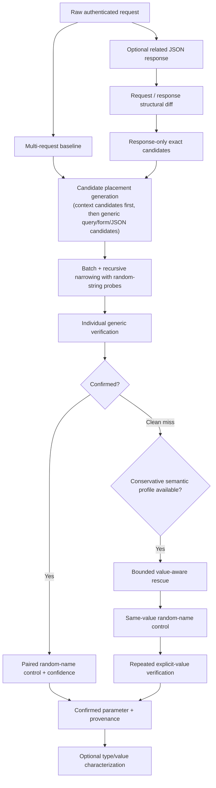

# ParamIntel v0.4.0

ParamIntel is an evidence-oriented HTTP parameter discovery and behavioral-analysis tool for authorized web security testing and bug bounty research.

Instead of treating any response difference as a valid parameter, ParamIntel asks a stronger question:

> **Does this specific parameter produce reproducible application behavior that a random unknown parameter does not?**

v0.3 improved candidate acquisition: it can learn application-specific JSON parameter names from a related response. v0.4 improves probe selection: when a candidate cleanly fails the normal random-string discovery path, ParamIntel can try a small, bounded semantic value profile such as `true`, `false`, `1`, or `0` while preserving the same negative-control philosophy.

By default, `-locations auto` always tests query candidates, adds form-body discovery for form-encoded requests, and adds JSON discovery whenever the captured body is a parseable JSON object. JSON structure is recognized even when the application uses a generic MIME type such as `text/plain`.

## What v0.4 adds

- bounded value-aware rescue for parameters that only react to specific semantic values;
- `-value-aware=true|false` (default `true`);
- `-value-aware-budget` (default `64`) as a hard cap on additional semantic requests;
- same-value paired random-name controls, for example `debug=true` versus `zz_pi_<random>=true`;
- repeated explicit-value verification without pooling evidence across different values;
- deterministic rescue ordering;
- conservative rescue eligibility: candidates that already showed generic candidate/control activity are not reinterpreted;
- discovery provenance fields: `discovery_mode`, `discovery_value`, and `discovery_value_kind`;
- typed JSON semantic discovery, so booleans and integers are sent as real JSON types;
- composition between v0.3 context intelligence and v0.4 value-aware discovery.

v0.4 preserves:

- multi-request baselines;
- semantic response comparison;
- batch-and-recursive narrowing;
- paired random-name negative controls;
- repeated verification trials;
- query, form, root JSON, and nested JSON discovery;
- context-derived candidate provenance;
- optional post-discovery type/value characterization;
- explicit opt-in for repeated potentially state-changing requests.

## Detection model



A reported parameter is a **research lead**, not proof of a vulnerability. Authorization, business-logic impact, and exploitability still require manual validation within program scope.

## Why value-aware discovery matters

Some parameters are real but ignore arbitrary values.

For example:

```text
/api/users
→ baseline

/api/users?debug=whatever
→ baseline

/api/users?debug=true
→ debug data added

/api/users?random_name=true
→ baseline
```

A generic random-string detector can miss this because:

```text
debug=<random-token>
→ baseline
```

v0.4 keeps the normal random-string path first. If that path produces a clean miss and the candidate has a conservative semantic profile, ParamIntel can try:

```text
debug=true
vs
zz_pi_<random>=true
```

Only candidate-specific behavior proceeds to repeated verification.

A value-aware finding can look like:

```json
{
  "name": "debug",
  "location": "query",
  "discovery_mode": "value_aware",
  "discovery_value": "true",
  "discovery_value_kind": "string",
  "confidence": 1.00,
  "confidence_label": "high",
  "candidate_changed": 3,
  "candidate_trials": 3,
  "random_control_changed": 0,
  "random_control_trials": 3
}
```

`-characterize=false` does **not** disable value-aware discovery. Discovery and characterization solve different problems.

## Request-budget model

Value-aware discovery can cost more requests, so v0.4 has a separate hard budget:

```text
-value-aware-budget 64
```

The budget includes semantic screening, same-value controls, and repeated confirmation requests. ParamIntel reserves the complete repeated-verification cost before starting confirmation, so it never crosses the configured cap halfway through a finding.

When the final allowed request consumes the budget, verbose output reports:

```text
semantic probe budget exhausted: 64/64 requests used
```

The default semantic profiles remain intentionally small. ParamIntel does not spray large business-state enum dictionaries automatically.

## Context intelligence + value-aware discovery

v0.3 and v0.4 compose.

Suppose the request already contains:

```json
{
  "options": {
    "page_size": 10
  }
}
```

and a related response contains:

```json
{
  "options": {
    "page_size": 10,
    "include_deleted": false
  }
}
```

Context intelligence can derive:

```text
$.options.include_deleted
```

with provenance:

```text
source: context_response_only_json_property
observed type: boolean
```

If a random string does nothing but JSON boolean `true` changes behavior, v0.4 can discover it with a real JSON boolean while preserving the context source:

```json
{
  "name": "include_deleted",
  "location": "json",
  "json_path": "$.options.include_deleted",
  "candidate_sources": [
    {
      "source": "context_response_only_json_property",
      "path": "$.options.include_deleted",
      "observed_type": "boolean",
      "priority": 100
    }
  ],
  "discovery_mode": "value_aware",
  "discovery_value": "true",
  "discovery_value_kind": "boolean"
}
```

The observed response type is still provenance, not proof. Active candidate/control verification remains authoritative.

## Context-intelligence boundary

Context harvesting intentionally stays narrow:

- only JSON property **keys** become contextual candidates;
- string values in a response are never split into candidate words;
- a nested response-only property is actionable only when its parent JSON object already exists in the request;
- arrays are not traversed for insertion targets;
- ParamIntel does not synthesize missing nested object scaffolding;
- a context-derived property is still only a candidate until active verification passes.

## Build

Requires Go 1.23+.

Linux/macOS:

```bash
go build -trimpath -o paramintel ./cmd/paramintel
```

Windows PowerShell:

```powershell
go build -trimpath -o paramintel.exe .\cmd\paramintel
```

Confirm version:

```powershell
.\paramintel.exe -version
```

Expected:

```text
ParamIntel v0.4.0
```

## Basic query discovery

Save an authorized request:

```http
GET /api/users HTTP/1.1
Host: target.example
Authorization: Bearer REDACTED
Cookie: session=REDACTED

```

Run:

```powershell
.\paramintel.exe `
  -request .\burprequests\users.txt `
  -locations query `
  -baseline 5 `
  -trials 3 `
  -chunk 32 `
  -verbose `
  -output .\findings.json
```

Value-aware rescue is enabled by default. Disable it when you want strict v0.3-style behavior:

```text
-value-aware=false
```

## Context-response workflow

Save the authorized request and a related response, then run:

```powershell
.\paramintel.exe `
  -request .\burprequests\request.txt `
  -context-response .\burpresponses\response.txt `
  -locations json `
  -baseline 5 `
  -trials 3 `
  -chunk 4 `
  -value-aware=true `
  -value-aware-budget 64 `
  -allow-state-changing `
  -verbose `
  -output .\findings.json
```

## Form and JSON discovery

Locations:

```text
-locations auto
-locations query
-locations form
-locations json
-locations query,json
```

`auto` always includes query discovery, adds form discovery for `application/x-www-form-urlencoded`, and adds JSON discovery whenever the body parses as a JSON object.

Nested JSON object insertion is controlled with:

```text
-json-depth 3
```

Arrays remain intentionally outside the insertion model.

## Characterization

After a parameter is confirmed, ParamIntel can optionally profile likely values and infer type hints.

Examples include:

- boolean-like: `true`, `false`, `1`, `0`;
- integer-like: `0`, `1`, `10`, `-1`;
- `format`: `json`, `xml`, `html`;
- `sort` / `order`: `asc`, `desc`.

For JSON parameters, boolean and integer profile values are sent as actual JSON types.

Disable post-discovery characterization:

```text
-characterize=false
```

This does not disable value-aware discovery.

## Safety guard for state-changing methods

GET, HEAD, and OPTIONS can run normally.

POST, PUT, PATCH, DELETE, and other methods require explicit acknowledgement because ParamIntel replays the supplied request many times:

```text
-allow-state-changing
```

Use this only after confirming authorization and side-effect risk.

## Verification

Run:

```bash
go test ./...
go vet ./...
go test -race ./...
```

The v0.4 verification record also documents manual before/after acceptance where the same controlled `debug=true` endpoint produced `0 parameters` in v0.3 and a single high-confidence `debug` finding in v0.4.

See:

```text
VERIFICATION.txt
docs/v0.4-value-aware-discovery.md
```

## Known boundaries

v0.4 deliberately does **not** add:

- cache-aware probe correlation;
- server-side parameter-pollution mutation inside another parameter value;
- missing-parent JSON object synthesis;
- array insertion;
- AI-generated semantic values;
- Burp/MCP integration;
- broad business-state enum spraying.

These require separate evidence and design rather than being folded into value-aware discovery.

## Project layout

```text
cmd/paramintel/        CLI and safety boundary
internal/baseline/    baseline collection and request sending
internal/candidates/  generic candidate wordlists
internal/compare/     semantic response comparison
internal/confidence/  confidence scoring
internal/contextintel/ structured request/response candidate intelligence
internal/discovery/   placement, narrowing, verification, controls, semantic rescue
internal/httpraw/     raw HTTP request parser
internal/model/       shared evidence/result types
internal/mutate/      query/form/JSON mutation engine
internal/semantics/   type inference and conservative semantic value profiles
```

## Scope and responsible use

Use ParamIntel only on systems you own or are explicitly authorized to test. Respect bug bounty scope, rate limits, forbidden actions, and data-handling rules. ParamIntel discovers and characterizes inputs; it does not automatically claim that a discovered parameter is vulnerable.

Raw Burp requests and responses can contain session cookies, authorization headers, identifiers, and target data. Keep local research artifacts out of source control. The default `.gitignore` excludes `burprequests/`, `burpresponses/`, and `wordlists/` for this reason.
