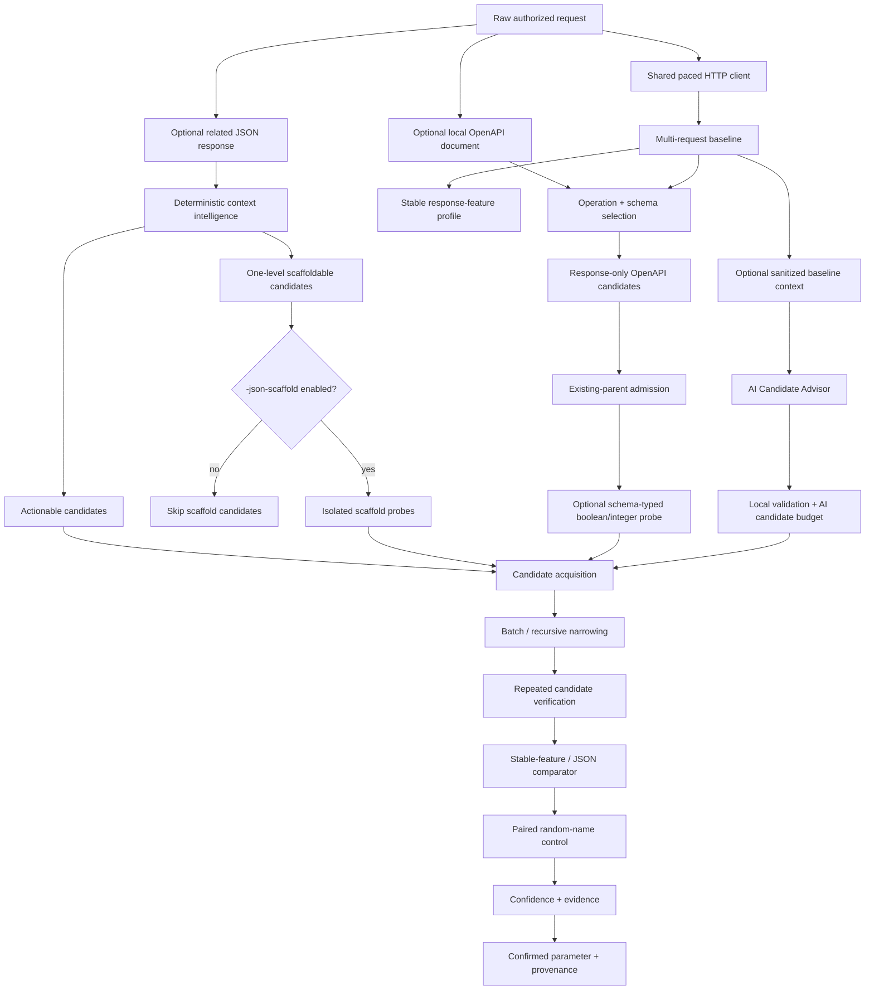

# ParamIntel v0.10.0

ParamIntel is an evidence-oriented HTTP parameter discovery and behavioral-analysis tool for authorized web security testing and bug bounty research.

Instead of treating every response difference as a valid parameter, ParamIntel asks:

> **Does this specific parameter produce reproducible application behavior that a random unknown parameter does not?**
>
> **Are the responses and response features used to make that decision stable enough to trust?**

A reported parameter is a **research lead**, not proof of a vulnerability. Authorization, exploitability, business impact, and program rules still require manual validation.

## Version progression

ParamIntel has evolved in deliberate layers:

- **v0.3 — better candidate names:** derive high-signal JSON candidates from a related response;
- **v0.4 — better candidate values:** rescue clean generic misses with bounded semantic values and same-value random-name controls;
- **v0.5 — better evidence integrity:** keep known rate-limit/backoff responses out of evidence and optionally pace all requests;
- **v0.6 — better candidate hypotheses:** optionally use an AI Candidate Advisor while keeping deterministic verification authoritative;
- **v0.7 — better evidence fidelity:** learn stable response features and detect subtle non-JSON behavior without abandoning negative controls;
- **v0.8 — deeper structured JSON discovery:** optionally test narrowly response-derived nested fields behind exactly one missing object parent;
- **v0.9 — local OpenAPI candidate intelligence:** use a local OpenAPI document to derive high-signal response-only JSON hypotheses and, when unambiguous, choose safe boolean/integer probe types;
- **v0.9.1 — response decoding reliability:** normalize replayed `Accept-Encoding` so Burp-captured mobile requests can use Go's transparent response decoding and retain JSON-semantic evidence;
- **v0.9.2 — OpenAPI nullability consistency:** preserve nullable schema provenance and withhold schema-typed shortcuts from nullable scalar declarations;
- **v0.9.3 — supported Go runtime baseline:** move the supported minimum to Go 1.26 and validate the full release gate on Go 1.26.x and Go 1.27.x;
- **v0.10 — AI Semantic Value Advisor:** optionally propose bounded application-specific values for known candidates after deterministic value-aware discovery cleanly misses, while preserving the same candidate/control verification and confidence model.

The current governing rule is:

> **OpenAPI and AI may tell ParamIntel what is worth testing, where it may belong, or which bounded value hypothesis is worth trying. Only live application behavior, repeated trials, paired random-name controls, and existing confidence/evidence rules may produce a finding.**

Schema metadata and AI output are hypothesis input, not evidence.

## What v0.9 adds

v0.9 introduces a local `-openapi` workflow for JSON APIs.

Given a captured request and a local OpenAPI 3.x document, ParamIntel can:

- select the matching operation by HTTP method and request path;
- prefer an exact concrete path over a matching template;
- reject ambiguous template matches instead of choosing one implicitly;
- select the request schema from the captured request Content-Type;
- select the response schema from the stable baseline status and Content-Type;
- compare request and response schema properties;
- derive `openapi_response_only_json_property` candidates;
- activate only candidates whose JSON parent already exists in the captured request;
- preserve declared types, `nullable`, `readOnly`, `writeOnly`, `required`, and schema-reference metadata as provenance;
- use a real JSON boolean `true` for a single unambiguous non-nullable `boolean` declaration;
- use a real JSON integer `1` for a single unambiguous non-nullable `integer` declaration;
- keep the paired random-name control on the exact same typed value.

A schema declaration never raises confidence by itself.

### OpenAPI example

If the request schema contains:

```text
$.profile.name
```

and the selected response schema contains:

```text
$.profile.name
$.profile.beta_access
```

ParamIntel can prioritize:

```text
$.profile.beta_access
source: openapi_response_only_json_property
placement: existing_parent
```

If OpenAPI declares that field as exactly a non-nullable `boolean`, the experiment becomes:

```json
candidate: {"profile":{"beta_access":true}}
control:   {"profile":{"zz_pi_random":true}}
```

Only the leaf name differs.

If the server reacts to every unknown boolean property, candidate and control both change and ParamIntel rejects the finding.

## OpenAPI workflow

```powershell
.\paramintel.exe `
  -request .\burprequests\request.txt `
  -openapi .\openapi.yaml `
  -scheme https `
  -locations json `
  -allow-state-changing `
  -baseline 3 `
  -trials 3 `
  -chunk 8 `
  -characterize=false `
  -value-aware=false `
  -verbose `
  -output .\openapi-findings.json
```

`-openapi` reads a local document only. ParamIntel does not discover or download specifications automatically.

### v0.9 OpenAPI boundaries

v0.9 deliberately does **not**:

- enumerate every endpoint from a specification;
- fuzz every schema property or generate broad request matrices;
- treat `readOnly`, `writeOnly`, `required`, or schema membership as proof of server behavior;
- follow remote OpenAPI references;
- follow external file references;
- activate OpenAPI-derived one-level scaffolds;
- use schema `enum`, `default`, `example`, `examples`, or `const` values as probes;
- choose a typed representative for unions such as `[boolean, null]`;
- traverse arrays for candidate insertion;
- synthesize objects or multi-level JSON structure from OpenAPI;
- use `oneOf` or `anyOf` subtrees as active candidates in this release.

OpenAPI descriptors whose parent is missing may still be classified as `one_level_scaffold`, but they remain passive in v0.9.

## Schema-typed probes

Typed probing is intentionally narrow.

```text
single non-nullable declared boolean -> true
single non-nullable declared integer -> 1
```

Everything else remains on the existing generic path, including:

```text
string
number
null
nullable scalar declarations
multi-type / union declarations
objects
arrays
context-response candidates
AI candidates
generic wordlist candidates
```

Starting in v0.9.2, OpenAPI `nullable: true` is preserved as candidate provenance and prevents the schema-typed boolean/integer shortcut. ParamIntel does not introduce `null` as a new probe; nullable candidates simply remain on the normal verification path.

Accepted schema-typed findings include audit fields such as:

```text
discovery_mode: schema_typed
discovery_value: true
discovery_value_kind: boolean
```

The schema type only chooses the candidate/control value. It does not change confidence scoring or verification rules.

See:

```text
docs/v0.9-local-openapi-candidate-intelligence.md
docs/v0.9-slice2-openapi-candidate-bridge.md
docs/v0.9-slice3-schema-typed-probes.md
labs/v0.9-openapi-intelligence/README.md
labs/v0.9-schema-typed-probes/README.md
```

## v0.9 acceptance

Automated and manual acceptance proves:

1. a response-only OpenAPI field whose parent already exists can enter the normal verifier;
2. real candidate-specific behavior can reach 3/3 candidate changes with 0/3 paired-control changes;
3. generic unknown-field behavior is rejected when candidate and control both change;
4. OpenAPI one-level scaffold descriptors remain withheld;
5. an unambiguous non-nullable boolean declaration can use a real JSON `true` probe from the first pass;
6. an unambiguous non-nullable integer declaration can use a real JSON `1` probe from the first pass;
7. generic boolean behavior is rejected because the random-name control receives the same boolean value;
8. a union such as `[boolean, null]` does not authorize schema-typed probing even when a direct manual boolean request proves the endpoint would react;
9. `nullable: true` is preserved and does not authorize a single-type boolean/integer shortcut in v0.9.2.

## v0.8 controlled JSON scaffolding remains active

v0.8 scaffolding is still available, but its authority source remains **deterministic `-context-response` structure only**.

Enable it with:

```powershell
.\paramintel.exe `
  -request .\burprequests\request.txt `
  -context-response .\burpresponses\response.json `
  -locations json `
  -json-scaffold `
  -allow-state-changing `
  -baseline 5 `
  -trials 3 `
  -verbose `
  -output .\findings.json
```

The rule remains:

> **ParamIntel may create exactly one missing JSON object level only for a deterministic response-derived candidate, only when its direct ancestor already exists as a request object, and only when the user explicitly enables `-json-scaffold` together with `-context-response`.**

OpenAPI candidates do not gain this authority in v0.9.

See:

```text
docs/v0.8-controlled-json-scaffolding.md
labs/v0.8-json-scaffolding/README.md
```

## Discovery and evidence model



Important invariants:

> **A known rate-limit/backoff response must never influence ParamIntel confidence or behavioral evidence.**

> **An AI suggestion is only a hypothesis until deterministic probing and controls verify candidate-specific behavior.**

> **An OpenAPI declaration is only a hypothesis until deterministic probing and controls verify candidate-specific behavior.**

> **A new response feature is not evidence unless baseline sampling establishes the required stability.**

> **A scaffold is placement metadata, not evidence. The paired random-name control receives the same scaffold.**

## Evidence fidelity

Depending on baseline stability and response type, evidence can include:

```text
status
content_type
header_added
header_removed
header_value_changed
html_structure_changed
line_count
word_count
json_path_added
json_path_removed
json_value_changed
body_changed
body_length
```

For JSON responses, stable JSON path semantics remain authoritative. Header evidence records eligible header names rather than raw custom-header values.

## Deterministic context intelligence

A related JSON response can contribute application-specific candidate names without contributing attack values.

If the response contains a property absent from the request:

- parent already exists in the request → **actionable** candidate;
- exactly one parent object is missing and its ancestor exists → **scaffoldable** candidate;
- deeper or mismatched structure → skipped.

Response text values are never tokenized into candidate names.

## AI Candidate Advisor

The AI Candidate Advisor remains optional and disabled by default. AI may propose candidate names and valid placements, but it cannot create findings or raise evidence confidence by itself.

AI candidates do not receive JSON scaffold authority.

For Gemini:

```powershell
$env:GEMINI_API_KEY = Read-Host "Gemini API key" -MaskInput
```

Then:

```powershell
.\paramintel.exe `
  -request .\burprequests\request.txt `
  -ai-advisor `
  -ai-provider gemini `
  -ai-candidate-budget 12 `
  -baseline 3 `
  -trials 3 `
  -verbose `
  -output .\findings.json
```

The provider receives bounded structural metadata rather than raw captured traffic. Hostnames, Authorization/Cookie data, query/form values, JSON primitive values, raw response text, arbitrary headers, and user wordlist names are intentionally excluded.


## AI Semantic Value Advisor

The AI Semantic Value Advisor is also optional and disabled by default. It is a second-stage rescue path for candidate names that normal probing and ParamIntel's deterministic semantic profiles fail to verify.

It does **not** replace value-aware discovery. ParamIntel first tries the existing deterministic path, then consults AI only for clean misses that still have request budget available.

For Gemini:

```powershell
.\paramintel.exe `
  -request .\burprequests\request.txt `
  -ai-value-advisor `
  -ai-provider gemini `
  -ai-value-budget 4 `
  -ai-value-candidate-budget 8 `
  -value-aware-budget 96 `
  -baseline 3 `
  -trials 3 `
  -verbose
```

The value advisor receives sanitized application structure, candidate metadata, deterministic values already covered locally, and only bounded locally filtered enum-like semantic hints from relevant response fields. Arbitrary primitive response values and raw response text are not exposed to the provider.

AI candidate-query budget is scheduled using local structural relevance so scarce model calls are spent on candidates supported by the observed application shape before unrelated generic candidates.

For each admitted AI value, ParamIntel still requires:

- a meaningful candidate response;
- a same-value random-name control that does not reproduce the behavior;
- complete repeated candidate/control verification;
- the normal confidence threshold.

Verified AI-value discoveries record `discovery_mode: ai_value_aware`. AI rationale and priority never contribute to confidence.

The reproducible localhost acceptance lab is in `labs/semantic-value-advisor`.

## Rate-limit and backoff integrity

Known limiter/backoff responses are rejected before they can become behavioral evidence.

- every HTTP `429 Too Many Requests` is treated as rate limiting;
- HTTP `503 Service Unavailable` is treated as explicit backoff only when accompanied by a valid `Retry-After` value;
- ordinary 503 responses without a valid `Retry-After` remain available to normal comparison;
- ordinary 403 responses are not automatically classified as rate limiting.

ParamIntel does not automatically retry after known backoff responses.

## Global request pacing

Use:

```text
-delay 250ms
```

The same transport-level request-start pacing policy applies to baseline collection, candidate probes, controls, scaffold probes, OpenAPI probes, value-aware rescue, and characterization.

Default:

```text
-delay 0
```

## Value-aware discovery

Some parameters only react to specific values:

```text
?debug=whatever    -> baseline behavior
?debug=true        -> changed behavior
?zz_pi_random=true -> baseline behavior
```

After a clean generic miss, ParamIntel can try a small curated semantic profile while preserving same-value random-name controls.

Controls:

```text
-value-aware=true
-value-aware-budget 64
```

## Build

Requires Go 1.26+.

Linux/macOS:

```bash
go build -trimpath -o paramintel ./cmd/paramintel
```

Windows PowerShell:

```powershell
go build -trimpath -o paramintel.exe .\cmd\paramintel
```

Confirm version:

```powershell
.\paramintel.exe -version
```

Expected:

```text
ParamIntel v0.10.0
```

## Basic query discovery

```powershell
.\paramintel.exe `
  -request .\burprequests\users.txt `
  -locations query `
  -baseline 5 `
  -trials 3 `
  -chunk 32 `
  -delay 200ms `
  -verbose `
  -output .\findings.json
```

## Standard context-response workflow

```powershell
.\paramintel.exe `
  -request .\burprequests\request.txt `
  -context-response .\burpresponses\response.txt `
  -locations json `
  -baseline 5 `
  -trials 3 `
  -allow-state-changing `
  -verbose `
  -output .\findings.json
```

## Deeper JSON context workflow

```powershell
.\paramintel.exe `
  -request .\burprequests\request.txt `
  -context-response .\burpresponses\response.txt `
  -locations json `
  -json-scaffold `
  -baseline 5 `
  -trials 3 `
  -chunk 4 `
  -value-aware=true `
  -value-aware-budget 64 `
  -delay 200ms `
  -allow-state-changing `
  -verbose `
  -output .\findings.json
```

## Discovery locations

```text
-locations auto
-locations query
-locations form
-locations json
-locations query,json
```

`auto` always includes query discovery, adds form discovery for `application/x-www-form-urlencoded`, and adds JSON discovery when the request body parses as a JSON object.

Existing nested JSON object insertion is bounded with:

```text
-json-depth 3
```

Arrays remain outside the insertion/scaffolding model.

## Characterization

After a parameter is confirmed, ParamIntel can optionally profile likely values and infer type hints.

Disable characterization with:

```text
-characterize=false
```

For JSON parameters, boolean and integer probes are sent as actual JSON types.

## Safety guard for state-changing methods

GET, HEAD, and OPTIONS can run normally.

POST, PUT, PATCH, DELETE, and other methods require explicit acknowledgement because ParamIntel can replay the supplied request many times:

```text
-allow-state-changing
```

Neither `-openapi` nor `-json-scaffold` bypasses this requirement.

Use ParamIntel only after confirming authorization and side-effect risk.

## Verification

Automated release gates:

```bash
go test ./...
go vet ./...
go test -race ./...
go build ./cmd/paramintel
```

CI also performs a Windows amd64 cross-build.

Reproducible acceptance material:

```text
labs/v0.9-openapi-intelligence/README.md
labs/v0.9-schema-typed-probes/README.md
labs/v0.8-json-scaffolding/README.md
labs/v0.7-evidence-fidelity/README.md
labs/v0.6-ai-advisor/README.md
labs/v0.5-rate-limit/README.md
```

## Known boundaries

v0.9 deliberately does **not** add:

- generic API endpoint enumeration from OpenAPI;
- broad schema fuzzing;
- remote/external OpenAPI reference loading;
- OpenAPI-derived JSON scaffold activation;
- schema enum/default/example/const value spraying;
- typed probing for ambiguous unions or arbitrary schema formats;
- multi-level missing-parent JSON synthesis;
- array insertion or array scaffolding;
- replacement of existing `null`, scalar, object, or array parents through scaffolding;
- generic-wordlist missing-parent invention;
- AI-generated missing-parent scaffolds;
- candidate-vs-control evidence-signature attribution when both sides change;
- cache-aware probe correlation or automatic cache-buster orchestration;
- header or cookie discovery locations;
- AI-generated semantic values;
- automatic retry or sleeping after `Retry-After`;
- adaptive concurrency;
- broad WAF/rate-limit inference;
- Burp/MCP integration;
- broad business-state enum spraying;
- automatic exploitation.

Gemini remains the first AI provider adapter. The provider boundary is isolated so future adapters can be added without changing discovery or confidence logic.

## Project layout

```text
cmd/paramintel/            CLI, acceptance tests, and safety boundary
internal/aiadvisor/        sanitized AI candidate acquisition and provider adapters
internal/baseline/         baseline collection, send boundary, backoff classification
internal/candidates/       generic candidate wordlists
internal/compare/          baseline construction and semantic response comparison
internal/confidence/       confidence scoring
internal/contextintel/     structured request/response candidate + scaffold classification
internal/discovery/        placement, narrowing, verification, controls, typed-probe gating
internal/httppolicy/       shared request-start pacing policy
internal/httpraw/          raw HTTP request parser
internal/model/            shared evidence/result/candidate types
internal/mutate/           query/form/JSON mutation and controlled scaffold primitive
internal/responsefeatures/ stable response-feature extraction and header fingerprinting
internal/schemaintel/      local OpenAPI parsing, operation/schema matching, candidate descriptors
internal/semantics/        type inference and curated semantic value profiles
labs/                      reproducible local acceptance labs
```

## Scope and responsible use

Use ParamIntel only on systems you own or are explicitly authorized to test. Respect bug bounty scope, published rate limits, forbidden actions, and data-handling rules.

Raw Burp requests and responses can contain session cookies, authorization headers, identifiers, and target data. Keep local research artifacts out of source control. The default `.gitignore` excludes `burprequests/`, `burpresponses/`, and `wordlists/`.
