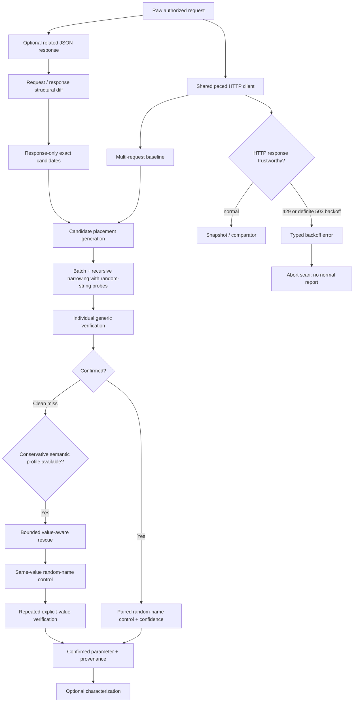

# ParamIntel v0.5.0

ParamIntel is an evidence-oriented HTTP parameter discovery and behavioral-analysis tool for authorized web security testing and bug bounty research.

Instead of treating any response difference as a valid parameter, ParamIntel asks two questions:

> **Does this specific parameter produce reproducible application behavior that a random unknown parameter does not?**
>
> **Are the responses used to make that decision trustworthy application observations rather than known rate-limit/backoff responses?**

The project has evolved in three deliberate layers:

- **v0.3 — better candidate names:** derive high-signal JSON candidates from a related response;
- **v0.4 — better candidate values:** rescue clean generic misses with a small curated semantic value profile;
- **v0.5 — better evidence integrity:** prevent definite rate-limit/backoff responses from entering the comparator and optionally pace all requests with one global policy.

A reported parameter remains a **research lead**, not proof of a vulnerability. Authorization, business-logic impact, exploitability, and program rules still require manual validation.

## What v0.5 adds

- HTTP `429 Too Many Requests` is treated as a definite rate-limit condition;
- HTTP `503 Service Unavailable` is treated as server backoff only when a valid `Retry-After` header is present;
- classified rate-limit/backoff responses are rejected before `Snapshot` construction and never reach behavioral comparison;
- typed backoff errors preserve status and safe `Retry-After` metadata for diagnostics;
- baseline, group probing, candidate verification, controls, value-aware rescue, and characterization all fail closed on known limiter responses;
- a rate-limit abort exits non-zero and does not write a normal findings report;
- `-delay` adds a global minimum interval between outbound request starts;
- pacing is context-cancellable and race-safe;
- `-delay 0` preserves the previous unpaced behavior;
- no automatic retries or automatic `Retry-After` sleeping are performed in v0.5.0.

v0.5 does **not** weaken or replace the v0.4 discovery model. The existing batch/narrow, paired random-name controls, repeated verification, semantic rescue, provenance, and characterization behavior remains in place.

## Detection and evidence-integrity model



The important v0.5 invariant is:

> **A response known to be rate-limited or explicitly server-backoff must never influence ParamIntel confidence or behavioral evidence.**

## Rate-limit and backoff behavior

### HTTP 429

Every HTTP 429 is rejected as a rate-limit condition.

For example:

```text
baseline = 200
candidate = 429
```

ParamIntel does **not** treat the status difference as candidate behavior. The experiment is invalid because the candidate response is known to represent throttling rather than trustworthy application behavior.

The CLI aborts with a diagnostic such as:

```text
error: rate limit detected: HTTP 429 (Retry-After: 2); response was not used as discovery evidence
```

### HTTP 503

HTTP 503 alone can mean many things, so v0.5 deliberately stays conservative.

```text
503 + valid Retry-After
→ server backoff
→ response rejected from evidence

503 without Retry-After
→ ordinary application response

503 + malformed Retry-After
→ ordinary application response
```

### HTTP 403

ParamIntel does not label an ordinary 403 as rate limiting. A 403 can represent authorization, WAF behavior, anti-bot behavior, or application logic and can therefore still be relevant behavioral evidence.

### Retry-After

Both standard forms are parsed:

```text
Retry-After: 10
```

and:

```text
Retry-After: Wed, 21 Oct 2015 07:28:00 GMT
```

Malformed values on a 429 remain visible as raw diagnostic metadata, but ParamIntel does not trust them for timing.

## Global request pacing

Use:

```text
-delay 250ms
```

The value is a **minimum interval between request starts**, not an unconditional sleep after every response.

For example:

```text
request 1 starts at T0
server takes 400ms
-delay 250ms
request 2 may start immediately after request 1 completes
```

because more than 250ms has already elapsed since the previous request start.

But if the server responds in 20ms:

```text
request 1 starts at T0
request 1 completes at T0 + 20ms
request 2 waits roughly 230ms
```

The same policy applies globally to:

- baseline samples;
- group probes;
- recursive narrowing;
- candidate trials;
- random-name controls;
- value-aware screens and controls;
- repeated semantic verification;
- post-discovery characterization.

Default:

```text
-delay 0
```

Negative delays are rejected before any HTTP request is sent.

## No automatic retry in v0.5.0

ParamIntel does not automatically retry requests after a 429/503-backoff response.

This is intentional. POST, PUT, PATCH, DELETE, and other potentially state-changing requests already require explicit `-allow-state-changing` acknowledgement. Hidden automatic replays would create a new side-effect model and are outside the first rate-limit implementation.

When evidence integrity is lost, v0.5 fails closed and asks the researcher to decide what to do next.

## Value-aware discovery

v0.4 behavior remains available unchanged.

Some parameters ignore arbitrary values:

```text
/api/users
→ baseline

/api/users?debug=whatever
→ baseline

/api/users?debug=true
→ debug data added

/api/users?random_name=true
→ baseline
```

A random-string detector can miss `debug`, so after a **clean generic miss** ParamIntel can try a small curated semantic profile:

```text
debug=true
vs
zz_pi_<random>=true
```

Only candidate-specific behavior proceeds to repeated verification.

Value-aware controls:

```text
-value-aware=true
-value-aware-budget 64
```

The semantic budget is a hard request cap and reserves the complete repeated-verification cost before confirmation begins.

Value-aware profiles are deliberately curated rather than exhaustive. They cover common high-signal parameter patterns, and new profiles should be added from demonstrated discovery gaps with regression evidence rather than speculative value dictionaries.

`-characterize=false` does not disable value-aware discovery.

## Context intelligence + value-aware discovery

A related JSON response can contribute application-specific candidate names without contributing attack values.

Suppose the request contains:

```json
{
  "options": {
    "page_size": 10
  },
  "items": []
}
```

and a related response contains:

```json
{
  "options": {
    "page_size": 10,
    "include_deleted": false
  },
  "items": []
}
```

ParamIntel can derive:

```text
$.options.include_deleted
source: context_response_only_json_property
observed type: boolean
```

If only typed JSON boolean `true` changes behavior, v0.4/v0.5 can preserve both layers of provenance:

```json
{
  "name": "include_deleted",
  "location": "json",
  "json_path": "$.options.include_deleted",
  "candidate_sources": [
    {
      "source": "context_response_only_json_property",
      "path": "$.options.include_deleted",
      "observed_type": "boolean",
      "priority": 100
    }
  ],
  "discovery_mode": "value_aware",
  "discovery_value": "true",
  "discovery_value_kind": "boolean"
}
```

The related response explains **why the candidate was tested**. Active candidate/control verification explains **why it was reported**.

## Context-intelligence boundary

Context harvesting remains deliberately narrow:

- only JSON property keys become contextual candidates;
- response values are never split into candidate words;
- nested response-only fields are actionable only when the request already contains their parent object;
- arrays are not traversed as insertion targets;
- missing object scaffolding is not synthesized;
- contextual observation alone never creates a finding.

## Build

Requires Go 1.23+.

Linux/macOS:

```bash
go build -trimpath -o paramintel ./cmd/paramintel
```

Windows PowerShell:

```powershell
go build -trimpath -o paramintel.exe .\cmd\paramintel
```

Confirm version:

```powershell
.\paramintel.exe -version
```

Expected:

```text
ParamIntel v0.5.0
```

## Basic query discovery

Save an authorized request:

```http
GET /api/users HTTP/1.1
Host: target.example
Authorization: Bearer REDACTED
Cookie: session=REDACTED

```

Run:

```powershell
.\paramintel.exe `
  -request .\burprequests\users.txt `
  -locations query `
  -baseline 5 `
  -trials 3 `
  -chunk 32 `
  -delay 200ms `
  -verbose `
  -output .\findings.json
```

Use pacing only when it fits the authorized target/program rules. `-delay 0` disables intentional pacing.

## Context-response workflow

```powershell
.\paramintel.exe `
  -request .\burprequests\request.txt `
  -context-response .\burpresponses\response.txt `
  -locations json `
  -baseline 5 `
  -trials 3 `
  -chunk 4 `
  -value-aware=true `
  -value-aware-budget 64 `
  -delay 200ms `
  -allow-state-changing `
  -verbose `
  -output .\findings.json
```

## Discovery locations

```text
-locations auto
-locations query
-locations form
-locations json
-locations query,json
```

`auto` always includes query discovery, adds form discovery for `application/x-www-form-urlencoded`, and adds JSON discovery whenever the body parses as a JSON object.

Nested JSON object insertion is controlled with:

```text
-json-depth 3
```

Arrays remain intentionally outside the insertion model.

## Characterization

After a parameter is confirmed, ParamIntel can optionally profile likely values and infer type hints.

Examples include:

- boolean-like: `true`, `false`, `1`, `0`;
- integer-like: `0`, `1`, `10`, `-1`;
- `format`: `json`, `xml`, `html`;
- `sort` / `order`: `asc`, `desc`.

For JSON parameters, boolean and integer values are sent as actual JSON types.

Disable characterization:

```text
-characterize=false
```

## Safety guard for state-changing methods

GET, HEAD, and OPTIONS can run normally.

POST, PUT, PATCH, DELETE, and other methods require explicit acknowledgement because ParamIntel replays the supplied request many times:

```text
-allow-state-changing
```

Use this only after confirming authorization and side-effect risk.

## Verification

Automated release gates:

```bash
go test ./...
go vet ./...
go test -race ./...
```

v0.5 additionally has a reproducible real-CLI acceptance lab covering:

- a normal baseline followed by an active-probe 429;
- a valid contextual candidate whose random-name control alone receives 429;
- global `-delay 100ms` request-start pacing.

See:

```text
VERIFICATION.txt
docs/v0.5-rate-limit-evidence-integrity.md
labs/v0.5-rate-limit/README.md
```

External Windows acceptance must be recorded before the v0.5 release PR is considered ready to merge.

## Known boundaries

v0.5 deliberately does **not** add:

- automatic retry or automatic sleeping after `Retry-After`;
- adaptive concurrency;
- WAF/rate-limit inference from arbitrary 403 pages or response text;
- cache-aware probe correlation;
- server-side parameter-pollution mutation inside another parameter value;
- missing-parent JSON object synthesis;
- array insertion;
- AI-generated semantic values;
- Burp/MCP integration;
- broad business-state enum spraying.

These require separate evidence and design rather than being folded into the current trust model.

## Project layout

```text
cmd/paramintel/        CLI and safety boundary
internal/baseline/    baseline collection, send boundary, backoff classification
internal/candidates/  generic candidate wordlists
internal/compare/     semantic response comparison
internal/confidence/  confidence scoring
internal/contextintel/ structured request/response candidate intelligence
internal/discovery/   placement, narrowing, verification, controls, semantic rescue
internal/httppolicy/  shared request-start pacing policy
internal/httpraw/     raw HTTP request parser
internal/model/       shared evidence/result types
internal/mutate/      query/form/JSON mutation engine
internal/semantics/   type inference and curated semantic value profiles
labs/                 reproducible local acceptance labs
```

## Scope and responsible use

Use ParamIntel only on systems you own or are explicitly authorized to test. Respect bug bounty scope, published rate limits, forbidden actions, and data-handling rules. ParamIntel discovers and characterizes inputs; it does not automatically claim that a discovered parameter is vulnerable.

Raw Burp requests and responses can contain session cookies, authorization headers, identifiers, and target data. Keep local research artifacts out of source control. The default `.gitignore` excludes `burprequests/`, `burpresponses/`, and `wordlists/` for this reason.
